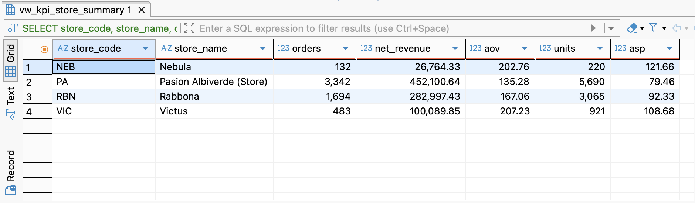
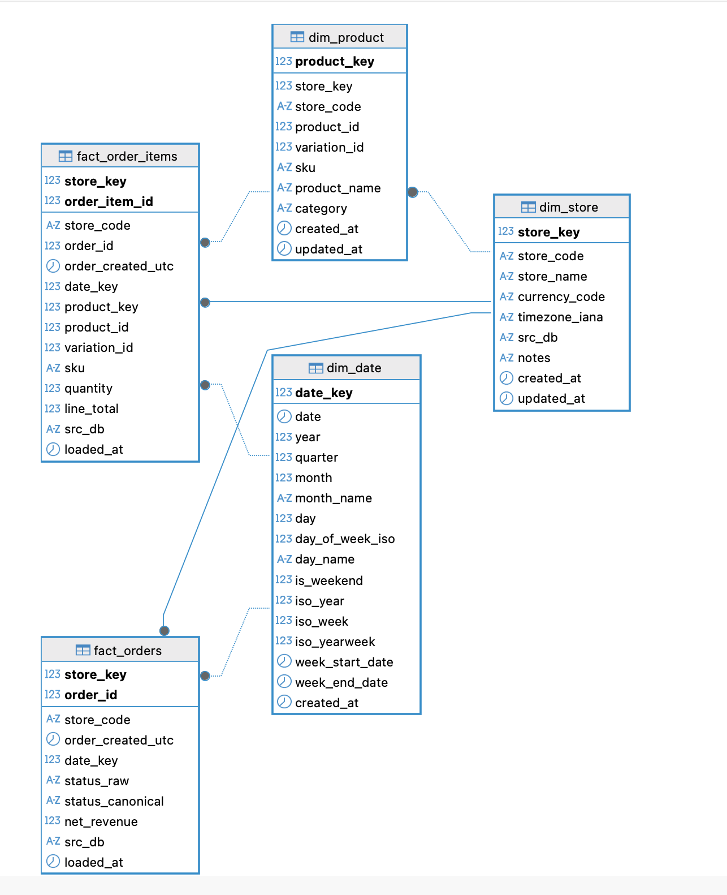

# Ecommerce Multistore Analytics Foundation (MariaDB)

A portfolio project that consolidates **4 historical WooCommerce stores** into a single **analytics database** and delivers a clean **star schema + KPI views + tests** ready for BI (Tableau).  
Built with **MariaDB** on Hostinger with a **batch refresh** workflow (no cross-DB queries allowed).

## What this repo contains
- **Staging layer** (CSV-loaded): `stg_orders`, `stg_order_items`
- **Conformed layer (star schema)**:
  - Dimensions: `dim_store`, `dim_date`, `dim_product`
  - Facts: `fact_orders`, `fact_order_items`
- **Metrics layer (views)**:
  - `vw_kpi_store_summary`
  - `vw_kpi_daily_store`
  - `vw_revenue_mix_store`
- **SQL tests** (uniqueness, orphans, sanity, coverage, reconciliation)

## Key design decisions
- **No PII**: no customer emails, names, addresses, phone numbers.
- **Multi-store correctness**: store-level keys prevent collisions across stores.
- **No revenue double-counting**: order KPIs are aggregated from `fact_orders` and item KPIs from `fact_order_items` separately.
- **Date standardization**: all metrics use `order_created_utc`.

## Tech stack
- MariaDB (Hostinger)
- DBeaver (extract/import + SQL execution)
- Tableau (dashboarding/visualization)

## KPI Snapshot (Multi-store)

## Data model (Star Schema)

## Project highlights
- Consolidated **4 WooCommerce stores** into a single analytics DB (Hostinger MariaDB) using a batch refresh workflow (no cross-DB queries).
- Built a **star schema** (dims/facts) + KPI views for store/day/product mix reporting.
- Validated data quality with **SQL tests** (uniqueness, FK/orphans, sanity, date coverage, KPI reconciliation).

## How to use (high-level)
1) Load CSVs into staging: `stg_orders`, `stg_order_items`
2) Build star schema tables (DDL)
3) Create views (metrics layer)
4) Run tests

SQL scripts:
- `sql/ddl.sql`
- `sql/views.sql`
- `sql/tests.sql`

## Repository structure
- `docs/` — project overview, data dictionary, and test documentation
- `sql/` — executable SQL (DDL, views, tests)

## Documentation
- **Foundation overview:** `docs/foundation_v1.md`
- **Data dictionary:** `docs/data_dictionary.md`
- **SQL tests:** `docs/tests_sql.md`

## Data sources (not included)
This repo does **not** include raw WooCommerce databases or CSV exports.
Only schema, views, tests, and documentation are versioned.
